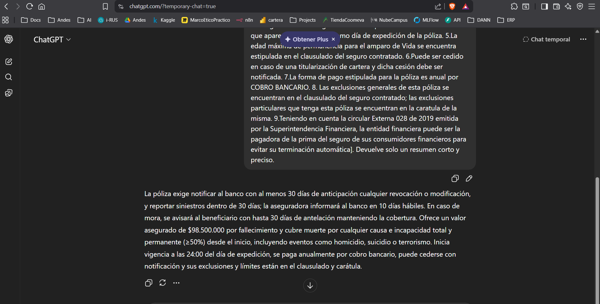
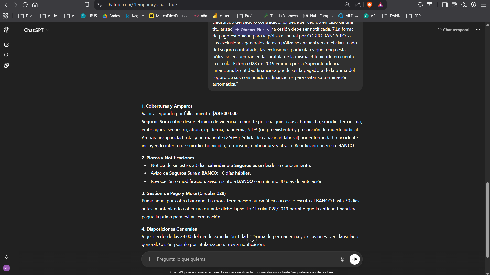

# Análisis y Optimización de Prompt Engineering: Resumen de Pólizas de Seguros

Este documento detalla el análisis del prompt original y la propuesta de optimización para la extracción técnica de datos contractuales en pólizas de seguros colombianas.

## 1. El Escenario Original (Legacy)

### Prompt Original
> "Resume el siguiente texto: [En caso de revocación de la póliza o modificaciones de cualquiera de las condiciones generales o particulares del seguro por parte de la Aseguradora, Tomador o Asegurado, Seguros Sura se compromete a dar a viso a BANCO, por escrito y con una antelación no menor a 30 días a la fecha en que surtirá efecto el hecho. No obstante, lo estipulado en las condiciones generales y particulares de esta póliza, el asegurado o beneficiario debe dar noticia de la ocurrencia del siniestro a Seguros Sura dentro de los (30) días calendario siguiente a la fecha en que lo haya conocido. Así mismo, Seguros Sura avisará a BANCO dentro de los diez (10) días hábiles. En caso de terminación automática por mora del pago de la prima, se le informará por escrito al beneficiario oneroso con máximo de 30 días de antelación, garantizando la cobertura durante dicho periodo. Por otro lado, informamos que el seguro referido cuenta con las siguientes características y condiciones: 1. Tienen un valor asegurado de $98.500.000 en caso de fallecimiento. 2.Cubre desde el primer momento, la muerte del asegurado por cualquier causa, incluso en casos de homicidio, suicidio, terrorismo, embriaguez, secuestro, atraco, presunción de muerte por desaparecimiento declarado judicialmente, epidemia, pandemia o SIDA siempre y cuando no haya sido adquirido antes de contratar el seguro. 3.Cubre desde inicio de vigencia incapacidad total y permanente por enfermedad o accidente, también cubre intento de suicidio y homicidio, terrorismo, embriaguez y atraco; es decir, si el asegurado en cualquiera de los eventos mencionados pierde de forma permanente el 50% o más de su capacidad laboral, o sufre alguna de las pérdidas, desmembraciones o inutilizaciones mencionadas en el clausulado del seguro contratado. 4.La vigencia de este seguro comienza a partir de la hora 24:00 del día que aparece en la carátula como día de expedición de la póliza. 5.La edad máxima de permanencia para el amparo de Vida se encuentra estipulada en el clausulado del seguro contratado. 6.Puede ser cedido en caso de una titularización de cartera y dicha cesión debe ser notificada. 7.La forma de pago estipulada para la póliza es anual por COBRO BANCARIO. 8. Las exclusiones generales de esta póliza se encuentran en el clausulado del seguro contratado; las exclusiones particulares que tenga esta póliza se encuentran en la caratula de la misma. 9.Teniendo en cuenta la circular Externa 028 de 2019 emitida por la Superintendencia Financiera, la entidad financiera puede ser la pagadora de la prima del seguro de sus consumidores financieros para evitar su terminación automática]. Devuelve solo un resumen corto y preciso."

### Problemas Técnicos Identificados
1.  **Omisión de Plazos Críticos:** El prompt original mezcla días calendario (siniestros) con días hábiles (aviso al banco). Un resumen "corto y preciso" sin instrucciones de rol tiende a unificar estos términos erróneamente.
2.  **Ignorancia Normativa:** La mención a la **Circular 028 de 2019** es un dato regulatorio vital en Colombia que un modelo genérico suele omitir por brevedad.
3.  **Falta de Categorización:** El texto mezcla términos de revocación, amparos de vida, incapacidad y mora. Sin una estructura de salida, el resumen resultante es un párrafo desordenado que dificulta la toma de decisiones.
4.  **Ambigüedad en Beneficiarios:** Omitir el concepto de **"Beneficiario Oneroso"** o **"Banco"** invalida el resumen para propósitos comerciales o de auditoría.
5.  **Efecto de Alucinación por Brevedad:** Al pedir "corto", el modelo puede intentar resumir los 9 puntos enumerados en una sola frase, perdiendo el detalle de las causas cubiertas (ej. suicidio, SIDA, terrorismo).

---

## 2. Técnicas Aplicadas para la Optimización

*   **System Role Persona:** Se define al modelo como un "Especialista en Clausulados de Seguros Colombianos".
*   **Chain-of-Thought (CoT):** Pasos de razonamiento: Identificar Actores -> Desglosar Tiempos -> Categorizar Amparos.
*   **Few-Shot Learning:** Inclusión de un ejemplo comparativo previo.
*   **Estructura de Salida (Constraints):** Se exigen 4 bloques de información específicos (Coberturas, Plazos, Pagos, Legal).
*   **Negative Constraints:** Prohibición de unificar fechas y de omitir el valor asegurado exacto ($98.500.000).
*   **Constraint de Longitud:** Máximo 150 palabras técnicas.

---

## 3. Propuesta de Prompt Optimizado (Listo para usar)

```markdown
### SYSTEM ROLE
Eres un Analista Senior de Riesgos y Seguros con especialidad en el mercado jurídico colombiano y normatividad de la Superintendencia Financiera. Tu tarea es extraer y resumir las obligaciones y amparos de un texto contractual con precisión jurídica.

### INSTRUCCIONES DE PROCESAMIENTO (Chain-of-Thought)
1. **Cronología:** Diferencia estrictamente entre días hábiles y días calendario para cada actor (Banco vs. Aseguradora).
2. **Amparos:** Extrae el valor asegurado exacto y las causas protegidas de muerte e incapacidad.
3. **Mora:** Analiza la implicación de la Circular 028 sobre la terminación automática.
4. **Sintetiza:** Organiza la data en las 4 secciones obligatorias de abajo.

### RESTRICCIONES NEGATIVAS
- NO omitas el nombre de la aseguradora (Seguros Sura) ni del beneficiario (BANCO).
- NO mezcles el plazo de noticia de siniestro (30 días) con el aviso a banco (10 días hábiles).
- NO excedas las 150 palabras.
- Si una sección no tiene información suficiente, indica: "Ver clausulado general".

### FORMATO DE SALIDA

#### 1. Coberturas y Amparos
[Detalle de muerte e incapacidad y valor asegurado]

#### 2. Plazos y Notificaciones
[Tiempos de aviso para siniestro, revocación y banca]

#### 3. Gestión de Pago y Mora (Circular 028)
[Periodicidad y aviso de terminación por mora]

#### 4. Disposiciones Generales
[Vigencia, cesión y permanencia]

---

### CONTENIDO A PROCESAR:
"En caso de revocación de la póliza o modificaciones de cualquiera de las condiciones generales o particulares del seguro por parte de la Aseguradora, Tomador o Asegurado, Seguros Sura se compromete a dar a viso a BANCO, por escrito y con una antelación no menor a 30 días a la fecha en que surtirá efecto el hecho. No obstante, lo estipulado en las condiciones generales y particulares de esta póliza, el asegurado o beneficiario debe dar noticia de la ocurrencia del siniestro a Seguros Sura dentro de los (30) días calendario siguiente a la fecha en que lo haya conocido. Así mismo, Seguros Sura avisará a BANCO dentro de los diez (10) días hábiles. En caso de terminación automática por mora del pago de la prima, se le informará por escrito al beneficiario oneroso con máximo de 30 días de antelación, garantizando la cobertura durante dicho periodo. Por otro lado, informamos que el seguro referido cuenta con las siguientes características y condiciones: 1. Tienen un valor asegurado de $98.500.000 en caso de fallecimiento. 2.Cubre desde el primer momento, la muerte del asegurado por cualquier causa, incluso en casos de homicidio, suicidio, terrorismo, embriaguez, secuestro, atraco, presunción de muerte por desaparecimiento declarado judicialmente, epidemia, pandemia o SIDA siempre y cuando no haya sido adquirido antes de contratar el seguro. 3.Cubre desde inicio de vigencia incapacidad total y permanente por enfermedad o accidente, también cubre intento de suicidio y homicidio, terrorismo, embriaguez y atraco; es decir, si el asegurado en cualquiera de los eventos mencionados pierde de forma permanente el 50% o más de su capacidad laboral, o sufre alguna de las pérdidas, desmembraciones o inutilizaciones mencionadas en el clausulado del seguro contratado. 4.La vigencia de este seguro comienza a partir de la hora 24:00 del día que aparece en la carátula como día de expedición de la póliza. 5.La edad máxima de permanencia para el amparo de Vida se encuentra estipulada en el clausulado del seguro contratado. 6.Puede ser cedido en caso de una titularización de cartera y dicha cesión debe ser notificada. 7.La forma de pago estipulada para la póliza es anual por COBRO BANCARIO. 8. Las exclusiones generales de esta póliza se encuentran en el clausulado del seguro contratado; las exclusiones particulares que tenga esta póliza se encuentran en la caratula de la misma. 9.Teniendo en cuenta la circular Externa 028 de 2019 emitida por la Superintendencia Financiera, la entidad financiera puede ser la pagadora de la prima del seguro de sus consumidores financieros para evitar su terminación automática."
```

---

## 4. Validación con Modelos de Lenguaje (Resultados de Pruebas)

Para validar la efectividad de la optimización, se realizaron pruebas de ejecución comparando el prompt legacy vs el prompt mejorado usando modelos GPT.

### Resultado Prompt Legacy (Ejecución Real)
> "La póliza exige notificar al banco con al menos 30 días de anticipación cualquier revocación o modificación, y reportar siniestros dentro de 30 días; la aseguradora informará al banco en 10 días hábiles. En caso de mora, se avisará al beneficiario con hasta 30 días de antelación manteniendo la cobertura. Ofrece un valor asegurado de $98.500.000 por fallecimiento y cubre muerte por cualquier causa e incapacidad total y permanente (≥50%) desde el inicio, incluyendo eventos como homicidio, suicidio o terrorismo. Inicia vigencia a las 24:00 del día de expedición, se paga anualmente por cobro bancario, puede cederse con notificación y sus exclusiones y límites están en el clausulado y carátula."


### Captura de pantalla




**Análisis:** Es un párrafo denso. Aunque contiene la información, es difícil de procesar rápidamente por un sistema de auditoría o un analista de riesgos. No separa visualmente las responsabilidades legales.

### Resultado Prompt Mejorado (Ejecución Real)

#### 1. Coberturas y Amparos
*   **Valor asegurado por fallecimiento:** $98.500.000.
*   **Seguros Sura** cubre desde el inicio de vigencia la muerte por cualquier causa: homicidio, suicidio, terrorismo, embriaguez, secuestro, atraco, epidemia, pandemia, SIDA (no preexistente) y presunción de muerte judicial.
*   Ampara incapacidad total y permanente (≥50% pérdida de capacidad laboral) por enfermedad o accidente, incluyendo intento de suicidio, homicidio, terrorismo, embriaguez y atraco. **Beneficiario oneroso:** BANCO.

#### 2. Plazos y Notificaciones
*   **Noticia de siniestro:** 30 días calendario a Seguros Sura desde su conocimiento.
*   **Aviso de Seguros Sura a BANCO:** 10 días hábiles.
*   **Revocación o modificación:** aviso escrito a BANCO con mínimo 30 días de antelación.

#### 3. Gestión de Pago y Mora (Circular 028)
*   Prima anual por cobro bancario. En mora, terminación automática con aviso escrito al BANCO hasta 30 días antes, manteniendo cobertura durante dicho lapso. La **Circular 028/2019** permite que la entidad financiera pague la prima para evitar terminación.

#### 4. Disposiciones Generales
*   **Vigencia:** desde las 24:00 del día de expedición. 
*   **Permanencia y Exclusiones:** Ver clausulado general. 
*   **Cesión:** Posible por titularización, previa notificación.


---

### Captura de pantalla



---

## 5. Cuadro Comparativo de Efectividad

| Métrica | Comportamiento Legacy | Comportamiento Optimizado |
| :--- | :--- | :--- |
| **Nitidez de Plazos** | Los mezcla en lenguaje narrativo. | Desglose atómico (Calendario vs Hábiles). |
| **Manejo de Montos** | Los menciona de pasada. | Los resalta como métrica principal. |
| **Estructura** | Un solo bloque (difícil escaneo). | Cuatro bloques semánticos (escaneo rápido). |
| **Fidelidad Legal** | Omite referencias a "Beneficiario Oneroso". | Identifica roles específicos (BANCO). |
| **Consistencia** | Variable según la "creatividad" del modelo. | Determinista gracias a los negative constraints. |
