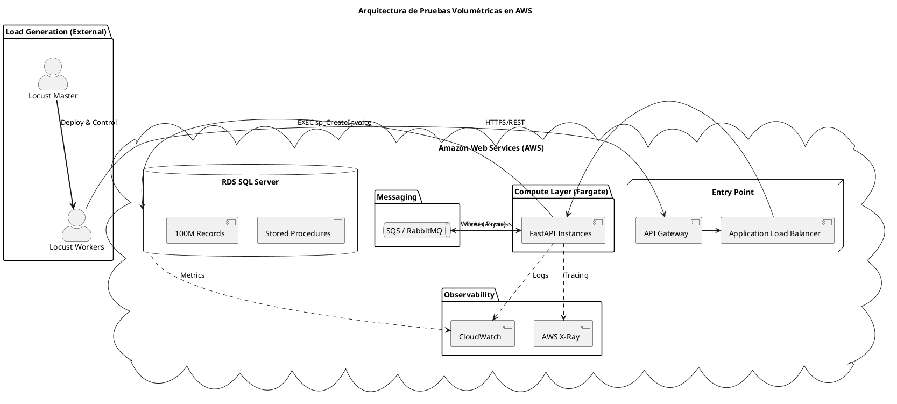

# Documento de Estrategia: Pruebas Volumétricas y de Rendimiento
**Proyecto:** Microservicio de Gestión de Facturas (FastAPI + SQL Server)

## 1. Fundamentos: ¿Qué es una Prueba Volumétrica?

El propósito de este documento es definir la estrategia para evaluar el comportamiento del sistema no solo ante la concurrencia (usuarios), sino ante el crecimiento masivo de la persistencia de datos.

### 1.1 Definición
Una **Prueba Volumétrica** consiste en someter a la aplicación a un volumen extremo de datos en su almacenamiento (base de datos). A diferencia de otras pruebas, el foco no es solo cuántas personas entran, sino cómo se comporta el motor de búsqueda y el sistema de archivos cuando las tablas pasan de miles a **cientos de millones de registros**.

### 1.2 Diferenciación Técnica

| Característica | Prueba de Carga (Load) | Prueba de Estrés (Stress) | Prueba Volumétrica (Volumetric) |
| :--- | :--- | :--- | :--- |
| **Foco Principal** | Usuarios concurrentes normales. | Límite de ruptura del sistema. | Volumen de datos persistidos. |
| **Objetivo** | Verificar cumplimiento de SLAs. | Evaluar recuperación ante fallos. | Verificar eficiencia de índices y almacenamiento. |
| **Escenario común** | 100 usuarios navegando. | Salto de 1.000 a 50.000 usuarios de golpe. | 100 millones de facturas en la tabla `invoices`. |
| **Métrica Clave** | Tiempo de respuesta promedio. | Disponiblidad (Uptime). | Latencia de Query e I/O de Disco. |

---

## 2. Diseño del Escenario de Pruebas

### 2.1 Caso de Uso Realista: "Cierre Fiscal de Multinacional"
Imaginemos una empresa de retail masivo procesando el cierre de año. Todos los puntos de venta están enviando facturas al microservicio simultáneamente (escritura) mientras el equipo de auditoría realiza búsquedas por nombre de cliente para conciliación (lectura).

### 2.2 Volúmenes Definidos
*   **Volumen de Datos (Persistencia):** Se poblará la base de datos con **100.000.000 (cien millones)** de facturas históricas antes de iniciar.
*   **Tasa de Transacciones (Throughput):** 
    *   **Escritura:** 1.500 `POST /invoice` por segundo.
    *   **Lectura Búsqueda:** 800 `GET /invoice/search` por segundo (con wildcards).
    *   **Lectura Puntual:** 1.000 `GET /invoice/{id}` por segundo.

---

## 3. Métricas, KPIs y Herramientas

### 3.1 Indicadores a Medir
1.  **Tiempos de Respuesta (Latencia):** p95 y p99. Indican que el 95% y 99% de las facturas se procesan en el tiempo esperado.
2.  **Uso de CPU (API y DB):** El motor SQL Server no debe superar el 80% de forma sostenida para evitar encolamiento de hilos.
3.  **Consumo de RAM:** Identificar posibles *memory leaks* en FastAPI al procesar listas grandes de resultados.
4.  **Tasa de Errores (Error Rate):** Porcentaje de respuestas 5xx o Timeouts.
5.  **Throughput:** Cantidad de transacciones exitosas por segundo aprovechando el pool de conexiones.
6.  **I/O Wait (Disco):** Tiempo que pasa la base de datos esperando a que el disco escriba la data (crítico en volumetría).

### 3.2 Herramientas Sugeridas
*   **Generación de Carga:** `Locust` (Python-based) por su capacidad de simular usuarios asíncronos distribuidos.
*   **Monitoreo de Infraestructura:** `AWS CloudWatch` para métricas de CPU/RAM de contenedores y base de datos.
*   **Tracing Distribuido:** `AWS X-Ray` o `Jaeger` para ver el tiempo que toma específicamente cada Stored Procedure.
*   **Perfilamiento de DB:** `SQL Server Profiler` o `Query Store` para identificar planes de ejecución costosos sobre tablas grandes.

---

## 4. Estrategia para la Ejecución

### 4.1 Planificación
1.  **Fase de Preparación (Data Seeding):** Uso de scripts de Python o Stored Procedures de carga masiva para generar los 100M de registros.
2.  **Configuración del Entorno:** Aislar el entorno de pruebas para que sea un espejo de producción (mismas capacidades de IOPS en disco).
3.  **Ejecución Gradual:** Ramp-up de usuarios para identificar el punto donde la latencia de DB empieza a subir exponencialmente.

### 4.2 Simulación de Alto Volumen
*   **Simulación de Datos:** Poblar la tabla con datos aleatorios pero con distribuciones de nombres de clientes realistas para probar la selectividad del índice.
*   **Simulación de Peticiones:** Utilizar un cluster de workers de **Locust** en contenedores independientes (ECS Fargate) para generar tráfico desde fuera de la red de la aplicación.

### 4.3 Criterios de Éxito o Fallo
*   **Éxito:**
    *   Latencia p95 < 300ms en inserciones.
    *   Búsquedas por cliente < 1 segundo a pesar de los 100M de registros.
    *   0.0% de pérdida de datos.
*   **Fallo:**
    *   Error rate > 1.0%.
    *   Degradación total del sistema por bloqueos de tabla (Deadlocks).
    *   Agotamiento de memoria en la API al serializar JSONs grandes.

---

## 5. Cuellos de Botella y Soluciones Sugeridas

### 5.1 Problemas Esperados
1.  **Fragmentación de Índices:** Con 100M de registros e inserciones constantes, el índice no-clustered en `client_name` se fragmentará, degradando las búsquedas.
2.  **Bloqueos de Página (Page Latching):** SQL Server puede bloquear páginas enteras de la tabla durante inserciones masivas, frenando las lecturas.
3.  **Serialización JSON Lenta:** Pydantic podría tomar mucho tiempo convirtiendo 1.000 filas de la DB a JSON en el endpoint de búsqueda.

### 5.2 Soluciones Propuestas
1.  **Estrategia de Particionamiento (Horizontal Partitioning):** Dividir la tabla `invoices` en particiones físicas basadas en el `issue_date` (mensual o anual). Esto permite al motor hacer "Partition Elimination", escaneando solo los archivos de datos relevantes.
2.  **Aislamiento por Snapshot (RCSI):** Activar `READ_COMMITTED_SNAPSHOT` a nivel de base de datos. A diferencia de `NOLOCK` (que puede leer datos inconsistentes), RCSI permite que las lecturas no bloqueen a las escrituras usando versiones de filas en `tempdb`, garantizando consistencia y alto throughput.
3.  **Mantenimiento de Índices:** Implementar un plan de mantenimiento nocturno para `REBUILD` de índices con un `FILLFACTOR` del 80%, reduciendo el "Page Splitting" durante las inserciones masivas del día.
4.  **Paginación a Nivel de Procedimiento:** Modificar el SP `sp_SearchInvoicesByClient` para soportar `OFFSET/FETCH NEXT`, evitando que la API sature su memoria al intentar procesar miles de registros de un cliente muy grande.

---

## 6. Arquitectura de Prueba (Diagrama en AWS)



---

## 7. Pseudo-Inyección de Carga (Locust)

```python
from locust import HttpUser, task, between

class VolumetricUser(HttpUser):
    wait_time = between(0.1, 0.5) # Simula peticiones muy rápidas

    @task(5)
    def stress_insert(self):
        self.client.post("/invoice/", json={
            "invoice_number": "STRESS-TEST",
            "client_name": "Empresa Grande S.A.",
            "client_id": "900-123",
            "total_amount": 5000.0,
            "issue_date": "2026-02-27"
        }, headers={"Authorization": "Bearer ..."})

    @task(2)
    def volumetric_search(self):
        # Esta tarea evalúa el rendimiento del índice IX_Invoices_ClientName
        self.client.get("/invoice/search?client=Empresa", headers={"Authorization": "Bearer ..."})
```
